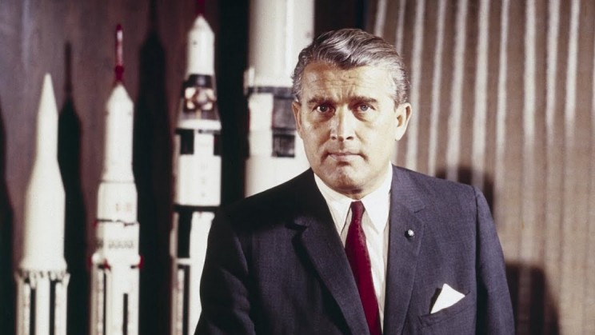

Every once in a while I bump into some text that somehow combines the issues of Artificial Intelligence and politics. Last time, it was [this](http://danmcquillan.io/ai_and_antifascism.html) article about the need of developing an antifascist AI, shared on one of the many generic AI&DL Facebook discussion groups.

Now to be clear, I really, really dislike that article. There are several fallacies, some very far-fetched analogies between algorithms and the far right, a bunch of stuff that this discussion doesn't really need - bringing up the fact that there are threads in GPUs, and also literal threads were used in the times of the Luddites? Really? But that's not the point.

 
*This is not an accurate depiction of a GPU-powered AI. Photo by Héctor J. Rivas on Unsplash*

The point is that while I don't think this is the way we should be talking about it, the discussion about the relationship between AI and social issues is one we need to have - and we need to have it soon.

To my immense disappointment, plenty of comments expressed a completely different view on this:

> Very dangerous because such adjectivies are slurs used subjectively. We should definitely keep politics out of AI.

> the fascists of the future will be the antifascists, leave your shit out of the AI

> Politics in AI is one thing. Bringing fad political ideologies into AI is dangerous. I feel violated after reading this.

> Sounds like a political piece, not scientifical…

Look. I get it, antifascism gets a lot of bad rap lately. And even though I, personally, am a proud antifascist (which literally just means I'm opposed to fascism), it's not what I'm trying to defend here. My point is that one way or another, this is a discussion we need to have.

Why? The reason might depend on whether you're more interested in thinking about the big picture, or the concrete things that are already happening, because both are relevant.

In the first case… it's pretty obvious, isn't it? AI is a very powerful technology, and every powerful technology has socioeconomic implications. Best case, we end up in some sort of AI-powered utopia. Worst case, a few rich oligarchs take control of our entire society with powerful AI and leave the rest of us in not-so-great conditions. It really doesn't require much imagination to see how it could go wrong.

I know cyberpunk is cool, but let's try to make it more cyber and less punk. Photo by Sean Foley on Unsplash

Otherwise, there's plenty of politics-ish situations where AI has already gone wrong. Keep in mind how modern AI methods work - they are trained on existing data. And if they learn from us, they will also reproduce our mistakes.

Want an example? Some time ago, FaceApp has developed a hotness filter - basically, take a selfie, and it makes you hotter. Simple as that, right? Well, turns out it gets problematic when the algorithm says that a [hot version of a black person is a white person](https://techcrunch.com/2017/04/25/faceapp-apologises-for-building-a-racist-ai/).

And this isn't a case of purposeful malice. It's not like one of the engineers there was like "Hey, let's make it so that white people are hotter than black people, it's gonna be fun :-D". It was more of a case of "Oh shit, we didn't think that far" (credits for this expression go to Anita Schjøll Brede from Iris.ai)

Sounds minor? It absolutely is. Sure, it could happen that some unaware black kid uses the filter, sees that they should become whiter in order to look hot and starts hating themselves for their ethnicity, but if you're still uncertain about this, you probably don't care about such scenarios. But what if a similar pattern occurs in a more serious area? Say, career? Another thing that Already Happened™ is [women being much less likely to see ads for high-paying prestigious jobs than men](https://www.washingtonpost.com/news/the-intersect/wp/2015/07/06/googles-algorithm-shows-prestigious-job-ads-to-men-but-not-to-women-heres-why-that-should-worry-you/).

"But hey, this is just ads! It's not like it actually affects anyone directly, it's not a big deal you SJW!" I hear you saying. But what if [an algorithm was actually biased against women when it comes to processing job applications](https://www.reuters.com/article/us-amazon-com-jobs-automation-insight/amazon-scraps-secret-ai-recruiting-tool-that-showed-bias-against-women-idUSKCN1MK08G)? This is serious stuff. If you don't think it is, please, please convince yourself otherwise or just stop working with AI.

Wernher von Braun. Don't be like him. AL.com/Youtube/NASA

Have you heard of a man called [Wernher von Braun](https://www.youtube.com/watch?v=QEJ9HrZq7Ro)? Without delving too deep into historical details - he was a brilliant scientist, a pioneer in rocket technology in Germany and the United States. More specifically, Nazi Germany. He just wanted to build rockets, and anyways can we keep politics out of rockets? He's just gonna build them, make sure they go up, and who cares where they go down? London? Berlin? New York? That's politics. Let's keep rockets apolitical, please.

But he sure helped a lot of widows in London get their pensions.

I guess the bottom line is - try to avoid the moments where you say "Oh shit, we didn't think this far" by actually thinking this far. And don't be like Wernher.
