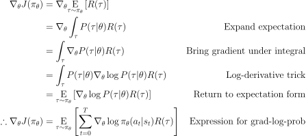

Ever since I started working on multiagent reinforcement learning, I felt somewhat underwhelmed by the algorithms that exist, especially in the policy gradient world. Sure, there's some approaches with really cool tricks, but ultimately it all seems to be "Take a single-agent algorithm and use it to optimize the policy/policies, adding some extra tweaks to make it behave better"

But multiagent learning has such a large potential for nontrivial behaviors, surely there must be some property that allows for a fundamentally different algorithm to be applied. We're using a hammer to put in a screw - but I want to make a screwdriver.

I've been scouring the literature, had a few false positives, but ultimately wasn't able to find anything that would fit the bill. I even had a semi-specific idea in my mind of what that algorithm might look like from the mathematical side - [Spinning Up](https://spinningup.openai.com/en/latest/spinningup/rl_intro3.html#deriving-the-simplest-policy-gradient) has a really nice derivation of the Policy Gradient theorem for single agent RL. So what if we follow the same lead, but adjust the assumption about the environment only being the function of a single agent?

Yesterday I finally sat down and did the math. And realized why "nobody came up with it" - it's just trivial. 

Let's take a look at the original derivation they presented:

In the entire proof, except for the very last line, it stays on the level of trajectories with $P(\tau|\theta)$ or $R(\tau)$, which is good - it's independent of however many agents we have, so we can just use all of that. But this doesn't lead us to a specific implementation - that happens in the last line. In fact, all we need to make it multiagent is change the expanded expression for $P(\tau | \theta)$ so that it uses the joint policy $\bar{\pi}_\theta(\bar{a}_t|\bar{s}_t)$ (working with homogeneous agents).

What is $\bar{\pi}_\theta(\bar{a}_t|\bar{s}_t)$? Well, it's the probability that each agent takes a certain action, which can be expressed as a product of the probabilities:

$\bar{\pi}\_\theta(\bar{a}\_t|\bar{s}\_t) = \prod\limits\_{i=0}^{N} \pi\_\theta(a\_t^i | s\_t^i)$ 

Naturally, working on logprobs this turns into:

$\log \bar{\pi}\_\theta(\bar{a}\_t|\bar{s}\_t) = \sum\limits\_{i=0}^{N} \log\pi\_\theta(a\_t^i | s\_t^i)$ 

Producing a final equation for the gradient estimate:

$\nabla_\theta J(\pi_\theta) = \mathop{\text{E}}\limits_{\tau\sim\pi_\theta} \left[ \sum\limits_{t=0}^T \sum\limits_{i=0}^N \log \pi_\theta(a_t^i | s_t^i) R(\tau)    \right]    $

Yep, it's just a linear combination of all agents' experiences. If you take the simple approach to optimizing a multiagent homogeneous policy by taking all agents' experiences and concatenating them, at some point you're going to average all the gradients which, surprise surprise, does exactly the same thing. (well, there might be a constant scaling factor, but that's hardly interesting)

Because as it turns out, summation is commutative. I know, tripped me up the first few times too.

What does that teach us? For me it certainly is a lesson that once I get a "great" idea for which I just need to figure out the mathematical details, it's better to just jump to math as soon as possible - at least it will spare me the disappointment.

And now, back to thinking "How the hell do I publish a paper in *this* economy?"
