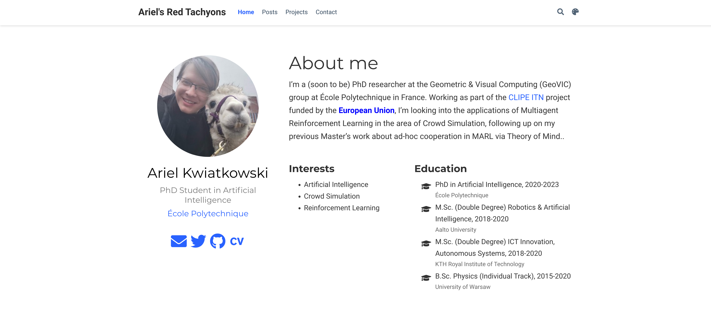

# IMPORTANT DISCLAIMER

Somewhere in the meanwhile, Hugo Academic seems to have undergone **major** changes, including a rebranding to Wowchemy, so this guide will likely be less than useful at this point. Some of the core ideas should still work, like registering a domain and hosting the website on netlify, but don't expect the details to be up-to-date. Sorry about that!

# Back to usual programming...

So, as you might have noticed, this is a fresh website. Setting it up was, at first, pretty frustrating, so if you're also thinking about setting up your own piece of internet to write posts like this, hopefully it'll help you avoid most of the problems.

If you want to get on to the technical stuff -- just go to the [Setup](#setup) part, since I know how frustrating it is to read the author's entire autobiography before they get to the point. However, I'd like to give you an idea of what to expect in terms of difficulty and features included -- basically a rationale for what I did what I did, and perhaps a more interesting narrative to read through. 

# What are we making?

As I'm about to begin a PhD, I looked back to my undergrad days -- ambitious, hopeful, looking up everyone at my university who works with similar stuff to get some research experience. And one thing I immensely appreciated was when researchers have personal websites detailing their research and invited visitors to contact them.

Another thing is that apparently, notoriety is useful in research -- and to this end, while I could probably just start a [twitter storm](https://twitter.com/ylecun/status/1274782757907030016) (as a side note: I'm team LeCun here), but a much more productive method would likely just be writing about my research (which I intend to do -- as soon as I start it).

Lastly, every once in a while I like making small programming projects. Just some visualization, maybe a game or an animation on HTML Canvas, and it'd be cool to host it on the internet somehow, under my own domain without having to setup a whole backend for that, worrying about security and all that.

So to summarize, what I wanted was a nice-looking blog platform that handles most boring stuff for me, allows some convenient functionality to show off my projects, and any ability to just host some HTML files under a URL path to do whatever I come up with. And of course, ideally I'd like it to be free.

And as an extra bonus, because I'm a stats nerd, it'd be cool to have some usage analytics to see where all the five visitors are from. Google Analytics maybe?

Spoiler alert: I managed all of this. So if it sounds like something you'd want, keep on reading.

# How much did I know?

To give you an idea of my technical skill, at the time of writing, I just finished a Master's degree in Autonomous Systems and am preparing to begin a PhD in Artificial Intelligence. I'm pretty comfortable with Python and to a smaller degree, other languages (of which the most relevant is probably JS, or preferably TS), and know enough web dev to write a simple server and a simple front-end... but that's about it in the web dev department.

Most notably, I'm severly lacking in any kind of graphic design skills, which messes things up a little bit. After all, if you're making a portfolio website, you want it to be pretty, and I'd rather eat my thesis than do a major project with CSS.

Fortunately, all that you need to know for this process is how to use the terminal, how to use Git (at least the very basics) and how to edit text documents. So in all likelihood, you're good to go. But even if Git sounds intimidating -- trust me, it's not, just make sure you have it installed (Mac/Linux) or install it (Windows), enter the commands in the article and the linked tutorials, and you'll be good to go.

# What have I tried? (and failed)

My first thought was using GitHub Pages -- it's techy, it's hip, I know a bunch of people with personal pages there, why not? I had actually tried it out with Jekyll a year ago or so, but didn't really like it -- I found the customization to be somewhat complicated, setting up the domain was more complicated than I would've liked it to be, and the website just looked... boring. 

Of course, with some more effort, you can also use other static site generators. There's a bunch of them, and the one that caught my eye was Hugo. Seemed to have decent reviews, with a bunch of nice themes, should still be hostable on GitHub Pages, right?

Wrong. I mean, I'm sure it's possible, it's probably also not that hard if you know what you're doing, but it just didn't happen in my case. I chose the Academic theme, which seems to be a whole beast in of itself. So from Hugo tutorials and quickstarts, I quickly moved on to Hugo Academic documentation, which made the local version of the website look really nice from the get-go, but for some reason, GitHub Pages just returned a build error, seemingly stemming from some unused file in the Academic theme. 

Then I went into the rabbit hole of trying to make my own fork of the Academic theme with the required change, to removing the submodule relation of a directory, all of that failing in the end. Sure, it worked on my localhost, but after pushing the changes to GitHub it was still broken.

In all of this I was so dead-set on using GitHub Pages that I ignored any other options, even the ones handed to me on a silver platter. You see, Hugo Academic has a one-click quickstart for Netlify. I was skeptical -- it's a service I'm not particularly familiar with, and the default domain name you get for free is something like [ecstatic-volhard-8cf203.netlify.app](https://ecstatic-volhard-8cf203.netlify.app) -- yea, that's not going to work for my hip research blog.

Thing is, when I set it up (for free), it worked like a dream. The page is instantly live under that ugly URL, so it might be worth giving it a shot? And what can I say -- it still worked great, I was able to tweak the website and have the new version live within a minute of pushing it to GitHub. 

So how hard is it to get a domain anyways? Pretty easy, as it turns out, at least if you're a student. See, there's this thing called [GitHub Education](https://education.github.com/) where you can get free access to a whole lot of free software -- be sure to check it out! One of the offers is a free .me domain on Namecheap for a year. Pretty cool, huh? If you're not a student -- well, you'll probably have to dish out a few bucks for the domain, but otherwise the process should be the same.

# Setup

So to summarize what we'll be building -- a Hugo blog using the Academic theme, hosted on Netlify from a GitHub repository, available through a free Namecheap domain. 

First things first, if you somehow don't already have one, get a free [GitHub](https://github.com/) account. If you're a student, make sure you sign up also for the [GitHub Education](https://education.github.com/) pack to get that sweet sweet free domain. 

As mentioned before, we'll be using Hugo which is a static website generator built in Go, but don't worry -- I didn't need to write or read a single line of Go, and neither will you. So head over to the [Hugo Quickstart page](https://gohugo.io/getting-started/quick-start/) and if you're anything like me and want to get at least a sense of what's happening, go through the tutorial to get a sense of what it is and how it works. But you can easily just skip this as well -- you can just look stuff up as you go in the future. If you want to do some development on your local machine (recommended, but not mandatory), go ahead and install Hugo according to the quickstart. And if you're fine with just testing in production by modifying files directly on GitHub... I mean, I'm not going to stop you, you can skip this entire paragraph and move on to the...

# Deployment

You might have noticed we haven't *really* set up the website. That's because the Academic theme and Netlify are coupled together so well that it really just happens automatically. You can see that for yourself -- just head over to the [Hugo Academic Getting Started](https://sourcethemes.com/academic/docs/install/) page and just follow their instructions -- click the nice looking button shown below and create a Netlify account. 

And just like that -- you have a live website! Sure, it's slightly lackluster and it's literally just a premade template, but hey -- once you figure out how to customize it and add some content, you'll be pretty much done, right?

Well, almost. As mentioned before, by default you get a domain name like [ecstatic-volhard-8cf203.netlify.app](ecstatic-volhard-8cf203.netlify.app) which just doesn't sound that memorable. That being said -- go to your [admin panel](https://app.netlify.com/) and check it out to make sure it works, even under that ugly address since now we're about to fix that.

Here, you generally have several viable options. For one, there's the Domains tab in your admin panel where you can buy a domain directly through Netlify, which I'm sure should be completely seamless and easy, so if that sounds good to you -- I'm sure you'll figure it out. Thing is, I'm stingy and don't want to pay. Luckily, I'm a student -- and here's where GitHub Education comes in. Head on over to [https://education.github.com/pack](https://education.github.com/pack) and go through the necessary process to Get the Pack. It could take a bit to get all the credentials confirmed -- if that's the case, just skip this section for now and come back when it's approved.

Once you have your Education Pack, check out the [offers](https://education.github.com/pack/offers). As you can see, there's a lot of them -- be sure to see if there's anything else you'd like! But right now just find the Namecheap offer and, per their suggestion, [connect your GitHub account to Namecheap](https://nc.me/github/auth). You can then choose a domain and, provided it's still available, get it completely for free for a full year!

Now we just need to connect the parts. If you go to the admin panel of Netlify, you should see a button that says Domain settings - go ahead and click it. Alternatively, you can just go to the Settings tab and choose Domain management. Either way, you'll be presented with a Custom domains window which should prompt you to add a domain. Add it, confirm you're the owner and you'll likely see some warning or error message -- don't worry! Just investigate it, and you should see some gibberish about an A-record and some IP address. Copy that address and head over to Namecheap. Log in, go to Manage on your freshly obtained domain, and switch to the Advanced DNS tab.

Full disclosure -- I'm not a web developer, I only have a vague idea of how this works, but since it does work, I have no reason to complain. In Advanced DNS, under Host Records, there will be some records. Go ahead and remove all A Records, and then create a new one. Again, you want it to be an A Record, with @ as the Host (don't ask me what that means though), and the Value set to the IP you copied earlier.

And, as a matter of fact, that is it. You can go to your beautiful domain and... wait, what? It's not there? Correct. The final component is time travel. Apparently, DNS changes like this can take 24-48h to propagate, so just jump that amount of time forward and voilà, your beautiful website is live under your beautiful domain!

# Customization

Now let's put something on the website! Since there's no way for me to predict what you want, I'm not going to copy-paste the entire Academic documentation since I can just [link](https://sourcethemes.com/academic/docs/install-locally/) it instead. I'm assuming you know the drill by now -- read the documentation, look up what you want to know in Google, and customize your website to your heart's delight. I'll just give you a few pointers to help avoid some potential hiccups on the way.

When creating the Netlify website, you had to choose a repository name for GitHub -- that's where your website's source code resides. While you can theoretically do all the changes from your browser, I highly recommend [cloning](https://docs.github.com/en/github/creating-cloning-and-archiving-repositories/cloning-a-repository) the repository to your computer and using a sane text editor for that. (for reference -- right now I'm using [VS Code](https://code.visualstudio.com/), it's pretty neat)

The workflow is as follows -- by navigating into the cloned directory and running the `./view.sh` script, you get an instance of your website running locally on your machine, on `localhost:1313` where you can instantly see any changes you make. Then, when you're satisfied with the outcome, you can push the changes to GitHub with the following commands:

`git add .`

`git commit -m "<SOME MESSAGE>"`

`git push origin master`

and within a minute or so, your actual website should be automatically updated.

If you're a stats nerd like me, you're gonna want some type of analytics. Since I sold my soul to Google anyways, I recommend setting up [Google Analytics](https://analytics.google.com/) where you can enter your website's address and receive a personal analytics ID. Then you simply need to add it to `config/_default/params.toml` under google_analytics, and that's it!

Lastly, I mentioned being able to just host any arbitrary html, regardless of all the templating shenanigans going on in Hugo. This proved to be surprisingly simple -- simply add a directory with the name corresponding to the path under which you want the page to be hosted under `./static`, e.g. `./static/custom`, add an `index.html` there and put in it whatever you desire. Then, when you push it to the server (or even on localhost) you should be able to access it with a URL like [https://redtachyon.me/custom](https://redtachyon.me/custom).

# Summary

If you've come this far, chances are, you haven't actually followed the tutorial -- yet. But if you have, you should have a live website under a nice .me domain, with an idea of how to customize it to your liking, and isn't that all a person needs for happiness?

Either way, I hope you enjoyed this brief journey through the process of making this exact website. Perhaps it will be helpful for someone who, like me a few months ago, was anxiously preparing to set up a website but didn't really know how to go about it. Because really, it's not that scary once you find what works for you. 

While you're here, feel free to check out the rest of my website, I'm actually really happy with the way it turned out. And if you're a recruiter from Google, please hire me :) 
